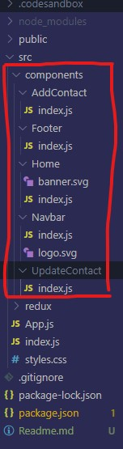

This `ABook.` is a very minimal and simple to save contacts list.

# Installation & prerequisites

This `ABook.` is a very minimal and simple to save contacts list.

#### NojeJs >14.0.0

#### JavaScript >ES6

#### React >16.0.0

#### HTML >5.0.0

#### CSS >3.0.0

#### Used few `npm modules` for animation and icons

# Usage

## [Live Demo](https://abook.vercel.app/)

This Address Book designed for save your contacts with minimalistic and simple interface. It's a simple and easy to use.

There are major features:

- Create new contact

- Upadate contact

- Delete contact

- Search contact

`Design System` is based on [Material-UI](https://material-ui.com/) and [React](https://reactjs.org/).

Components are divided into five parts:

- AddContact

- Home

- Navbar

- Footer

- UpdateContact

### Componenents flow :

# Running locally

Before you start make sure you have Node >14.0.0 is installed your local. You can find out how to check node version flowing this command: `node -v`

Clone `Abook.` project from `GitHub` repository and run `npm install` command.

Project clone form here (Abook.)[https://github.com/c4tbrilliantthoughts/ABook]

- Then run `npm start` command.
- bundle install
- bundle exec Abook serve
- Open your browser to http://localhost:3000

Any changes you make will automatically build and you will be able to see these by refreshing your browser.

# Author

Sumanth.Sanathi
